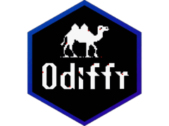

# Odiffr 

<!-- badges: start -->

[](https://CRAN.R-project.org/package=odiffr)
[](https://github.com/BenWolst/odiffr/actions/workflows/R-CMD-check.yaml)
[](https://app.codecov.io/gh/BenWolst/odiffr)

<!-- badges: end -->

Fast pixel-by-pixel image comparison for R, powered by [odiff](https://github.com/dmtrKovalenko/odiff).

## Features

- **Fast**: odiff is ~6x faster than ImageMagick, optimised with SIMD (SSE2, AVX2, AVX512, NEON)
- **Cross-platform**: Windows, macOS (Intel & Apple Silicon) and Linux
- **Flexible inputs**: image files, magick-image objects, plots (ggplot2, base and grid graphics) and PDF pages
- **Configurable**: threshold, antialiasing detection and ignore regions
- **Testing**: testthat expectations, snapshot testing with `expect_snapshot_image()`, and a compare function for shinytest2 screenshots
- **Batch workflows**: compare directories, approve changes, and report results as HTML, Markdown (GitHub job summaries) or JUnit XML
- **Validated environments**: pinnable binary and machine-readable audit records

## Installation

Install odiffr:

```r
install.packages("odiffr")

# Or the development version from GitHub
# install.packages("pak")
pak::pak("BenWolst/odiffr")
```

Odiffr requires the odiff binary (>= 4.1.1). The easiest way to get it is
from R, which downloads the binary for your platform to your user cache (no
Node.js needed):

```r
odiffr::install_odiff()
```

In interactive sessions, odiffr also offers to do this the first time odiff is
needed; it never downloads anything without asking. Alternatively, install
odiff system-wide:

```bash
# npm (cross-platform)
npm install -g odiff-bin

# Or download binaries from https://github.com/dmtrKovalenko/odiff/releases
```

## Quick Start

```r
library(odiffr)

result <- compare_images("baseline.png", "current.png", diff_output = "diff.png")
result$match
#> [1] FALSE
result$diff_percentage
#> [1] 2.45
```

## Comparing Images

```r
# Adjust sensitivity (0-1, lower = stricter) and ignore antialiased pixels
compare_images("img1.png", "img2.png", threshold = 0.05, antialiasing = TRUE)

# Fail immediately if dimensions differ
compare_images("img1.png", "img2.png", fail_on_layout = TRUE)

# Ignore areas with dynamic content, e.g. timestamps
compare_images("img1.png", "img2.png",
  ignore_regions = list(
    ignore_region(0, 0, 200, 50),     # header
    ignore_region(0, 500, 800, 600)   # footer
  )
)

# magick-image objects and plots work too
compare_images(magick::image_read("baseline.png"), "current.png")

# Low-level interface with every odiff option
odiff_run("img1.png", "img2.png", diff_lines = TRUE)
```

When a comparison fails, `plot(odiff_run(...))` shows the baseline, current
and diff images side by side, and `diff_image()` returns the diff as a
magick image or raster.

## Testing

### Expectations

```r
test_that("dashboard renders correctly", {
  expect_images_match("screenshots/current.png", "screenshots/baseline.png")
})

test_that("plot matches its baseline", {
  p <- ggplot2::ggplot(mtcars, ggplot2::aes(wt, mpg)) + ggplot2::geom_point()
  expect_images_match(p, test_path("baselines/scatter.png"),
                      plot_options = plot_options(width = 6, height = 4))
})
```

Plots (ggplot objects, functions that draw a plot, and recorded plots) are
rendered to PNG with ragg if installed. On failure, a diff image is saved to
`tests/testthat/_odiffr/`.

### Snapshot testing

`expect_snapshot_image()` lets testthat manage the baselines in
`tests/testthat/_snaps/`, while odiff does the comparison, so differences
below the threshold don't fail:

```r
test_that("plots are stable", {
  p <- ggplot2::ggplot(mtcars, ggplot2::aes(wt, mpg)) + ggplot2::geom_point()
  expect_snapshot_image(p)
  expect_snapshot_image(function() hist(mtcars$mpg), name = "mpg-hist",
                        preset = "screenshot")
})

# After an intended change
testthat::snapshot_review()
testthat::snapshot_accept()
```

Like other file snapshots, these are skipped on CRAN. `odiff_preset()` gives
calibrated settings (`"strict"`, `"default"`, `"screenshot"`,
`"cross_platform"`). On CI, `snapshot_report()` writes an HTML, Markdown or
JUnit report of all changed snapshots.

### Shiny apps (shinytest2)

Use odiff for shinytest2 screenshots to tolerate browser antialiasing noise
and get a diff image when a screenshot changes:

```r
app$expect_screenshot(compare = compare_file_odiff(preset = "screenshot"))
```

See `vignette("shinytest2", package = "odiffr")`, and
`vignette("web-pages", package = "odiffr")` for web pages and htmlwidgets.

## Batch Comparison and Reports

```r
# Compare two directories (matched by relative path)
results <- compare_image_dirs("baseline/", "current/", recursive = TRUE,
                              diff_dir = "diffs/")
summary(results)
failed_pairs(results)

# HTML report with baseline, current and diff thumbnails
batch_report(results, "diffs/report.html", images = "all", embed = TRUE)

# Or both steps in one call
compare_dirs_report("baseline/", "current/")

# Accept intended changes as the new baselines
approve_changes(results, dry_run = TRUE)
approve_changes(results)
```

Files missing from `current/` are reported as failing `"missing"` rows, and a
pair that can't be compared becomes an `"error"` row with the message in the
`error` column. `compare_images_batch()` compares an explicit list of pairs,
optionally in parallel.

### PDFs

```r
res <- compare_pdfs("before/report.pdf", "after/report.pdf", dpi = 150,
                    diff_dir = "pdf-diffs")
failed_pairs(res)[, c("page", "reason", "diff_percentage")]

# Every PDF in two directories, e.g. outputs before/after an R upgrade
res <- compare_pdf_dirs("outputs-old/", "outputs-new/", diff_dir = "pdf-diffs")
```

Requires the pdftools package. See
`vignette("pdf-outputs", package = "odiffr")`.

### CI

`use_odiffr_ci()` adds a ready-to-use GitHub Actions workflow to your package
(`.github/workflows/odiffr.yaml`) that installs odiff with `install_odiff()`,
runs your tests, summarises changed image snapshots with `snapshot_report()`
on the job summary page and uploads the new snapshots and diff images when
tests fail:

```r
odiffr::use_odiffr_ci()
```

Batch results can be written in formats CI systems display natively:

```yaml
      - name: Compare images
        run: |
          library(odiffr)
          results <- compare_image_dirs("baseline/", "current/", diff_dir = "diffs/")
          batch_markdown(results)                    # GitHub job summary
          batch_junit(results, "odiffr-junit.xml")   # test report
          batch_report(results, "diffs/report.html", images = "all", embed = TRUE)
          if (any(!results$match)) stop("Visual regression detected!")
        shell: Rscript {0}

      - name: Upload diffs
        if: failure()
        uses: actions/upload-artifact@v4
        with:
          name: visual-diffs
          path: diffs/
```

## Binary Management

```r
odiff_available()   # is odiff installed?
odiff_info()        # path, version and source
install_odiff()     # download odiff to the user cache
odiffr_update()     # same, lower-level (e.g. to update between releases)

# Use a specific binary
options(odiffr.path = "/path/to/odiff")
```

odiff is found via `options(odiffr.path)`, then the system PATH, then the
binary downloaded by `install_odiff()`. For npm installs (odiff >= 4.4), odiffr
calls the native binary directly rather than the Node.js launcher on the PATH,
which makes each comparison around 5x faster; set
`options(odiffr.resolve_npm = FALSE)` to disable this.

## Supported Formats

| Type   | Formats                                    |
| ------ | ------------------------------------------ |
| Input  | PNG, JPEG, WEBP, TIFF (`.tiff`), BMP; PDF via `compare_pdfs()` |
| Output | PNG only                                   |

Cross-format comparison is supported (e.g. JPEG against PNG). odiff does not
accept the `.tif` extension.

## For Validated Environments

- **Pinnable**: lock to a specific validated binary with `options(odiffr.path = ...)`
- **Audit records**: `audit_record()` writes a JSON or CSV record of comparisons, with input and output file hashes, the odiff version and binary hash, parameters, platform and a UTC timestamp
- **Base R core**: no non-base R package dependencies for core functions

```r
options(odiffr.path = "/validated/bin/odiff-4.5.0")

result <- odiff_run("baseline.png", "current.png", "diff.png", threshold = 0.05)
audit_record(result, file = "audit.json")
```

## Performance

odiff is approximately 6x faster than ImageMagick for pixel comparison, thanks
to SIMD optimisations. On x86_64 systems with AVX-512, pass `enable_asm = TRUE`
to `odiff_run()` for ~12% faster comparisons.

## Related

- [odiff](https://github.com/dmtrKovalenko/odiff) - the underlying CLI tool
- [vdiffr](https://CRAN.R-project.org/package=vdiffr) - SVG-based snapshot testing for ggplot2 and grid graphics (complements odiffr's pixel-based testing)
- [shinytest2](https://CRAN.R-project.org/package=shinytest2) - testing Shiny apps
- [magick](https://CRAN.R-project.org/package=magick) - R wrapper for ImageMagick

## License

MIT
